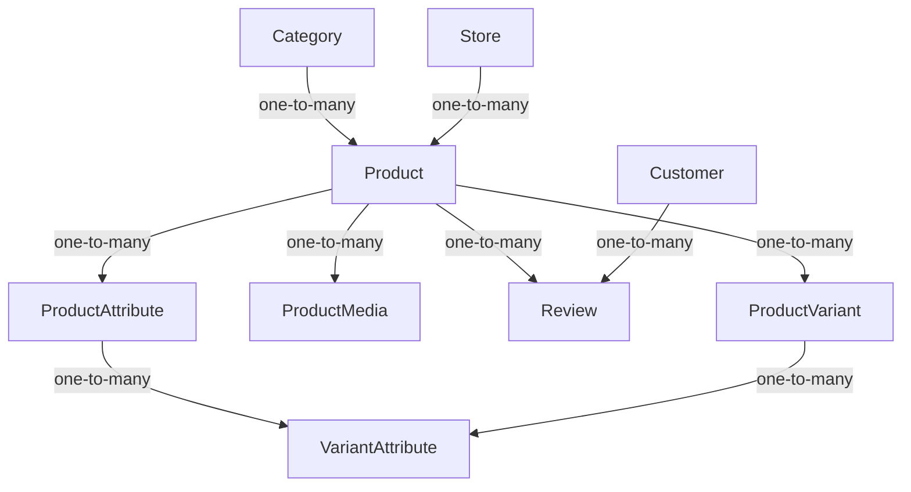
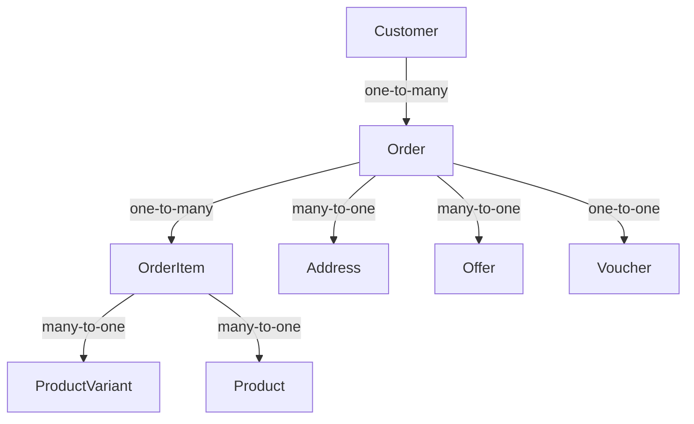
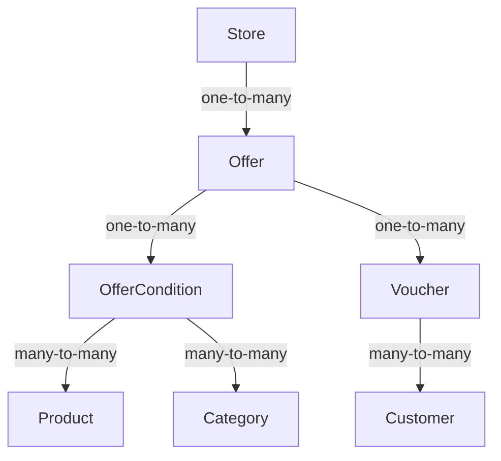

## Overview

The E-commerce API is built around several core models that represent products, orders, customers, and promotional offers. Understanding these models and their relationships is essential for effective API integration.

## Product Catalog

### Product Model

The central model for product information.

**Location:** `catalogue/models.py:38`

#### Key Fields

<ParamField path="name" type="string" required>
  Product name (unique, indexed)
</ParamField>

<ParamField path="category" type="ForeignKey" required>
  Product category reference
</ParamField>

<ParamField path="description" type="text" required>
  Detailed product description
</ParamField>

<ParamField path="store" type="ForeignKey">
  Store/vendor that owns this product
</ParamField>

<ParamField path="base_price" type="decimal" required>
  Base price (10 digits, 2 decimal places)
</ParamField>

<ParamField path="shipping_fee" type="decimal">
  Shipping cost (6 digits, 2 decimal places)
</ParamField>

<ParamField path="rating" type="float">
  Average rating calculated from reviews
</ParamField>

<ParamField path="is_standalone" type="boolean" default="true">
  Whether product has variants. False if product has multiple variants.
</ParamField>

<ParamField path="total_stock_level" type="integer" required>
  Total stock across all variants
</ParamField>

<ParamField path="total_sold" type="integer" default="0">
  Total units sold across all variants
</ParamField>

<ParamField path="is_available" type="boolean" default="true">
  Product availability status
</ParamField>

#### Important Methods

```python
# Check if product has variants
product.has_variants  # Property: returns bool

# Update stock levels from variants
product.update_stock_status()

# Calculate and update rating from reviews
product.update_rating()

# Get active promotional offers
product.get_active_offers()

# Find best applicable offer for customer
product.find_best_offer(customer)
```

#### Database Indexes

```python
indexes = [
    models.Index(fields=["category", "is_available"])
]
```

### Category Model

Organizes products into hierarchical categories.

**Location:** `catalogue/models.py:20`

<ParamField path="name" type="string" required>
  Category name (max 50 chars, indexed)
</ParamField>

<ParamField path="slug" type="slug">
  URL-friendly identifier (auto-generated from name)
</ParamField>

### ProductVariant Model

Represents different variations of a product (e.g., size, color).

**Location:** `catalogue/models.py:147`

#### Key Fields

<ParamField path="product" type="ForeignKey" required>
  Parent product
</ParamField>

<ParamField path="sku" type="string" required>
  Stock Keeping Unit (unique, max 20 chars, indexed)
</ParamField>

<ParamField path="is_default" type="boolean" default="false">
  Whether this is the default variant
</ParamField>

<ParamField path="price_adjustment" type="decimal" default="0.00">
  Amount to add/subtract from base price
</ParamField>

<ParamField path="stock_level" type="integer" required>
  Available stock for this variant
</ParamField>

<ParamField path="quantity_sold" type="integer" default="0">
  Total units sold
</ParamField>

#### Pricing Logic

```python
# Calculate actual price
variant.actual_price  # base_price + price_adjustment

# Get discounted price for customer
variant.get_discount_price(customer)

# Get final price (with or without discount)
variant.get_final_price(customer)
```

<Info>
  Standalone products must have exactly one default variant. Products with `is_standalone=False` can have multiple variants.
</Info>

### ProductAttribute & VariantAttribute

Define customizable attributes for products and their variants.

**Location:** `catalogue/models.py:127-210`

#### ProductAttribute

Defines available attributes for a product (e.g., "Size", "Color").

```python
class ProductAttribute(models.Model):
    product = ForeignKey(Product, related_name="attributes")
    attribute = ForeignKey(Attribute)
    name = CharField(max_length=255)
```

#### VariantAttribute

Assigns specific values to variant attributes (e.g., "Size: Large").

```python
class VariantAttribute(models.Model):
    variant = ForeignKey(ProductVariant, related_name="attributes")
    attribute = ForeignKey(ProductAttribute)
    value = CharField(max_length=255)
```

### ProductMedia Model

Handles images and videos for products with validation.

**Location:** `catalogue/models.py:212`

<ParamField path="product" type="ForeignKey" required>
  Associated product
</ParamField>

<ParamField path="file" type="FileField" required>
  Image or video file (validated)
</ParamField>

<ParamField path="is_primary" type="boolean" default="false">
  Whether this is the primary media
</ParamField>

#### Supported Formats

**Images:**
- JPEG (.jpg)
- PNG (.png)
- WebP (.webp)

**Videos:**
- MP4 (.mp4)
- WebM (.webm)

### Review Model

Customer reviews and ratings for products.

**Location:** `catalogue/models.py:286`

<ParamField path="user" type="ForeignKey" required>
  Customer who wrote the review
</ParamField>

<ParamField path="product" type="ForeignKey" required>
  Product being reviewed
</ParamField>

<ParamField path="review_text" type="text" required>
  Review content
</ParamField>

<ParamField path="rating" type="integer" required>
  Rating (1-5): 1=Very Bad, 2=Unsatisfied, 3=Just There, 4=Satisfied, 5=Very Satisfied
</ParamField>

<ParamField path="sentiment" type="string">
  Sentiment analysis result: POSITIVE, Neutral, or Negative
</ParamField>

<ParamField path="sentiment_score" type="float">
  Numerical sentiment score
</ParamField>

<Note>
  Reviews automatically update the product's average rating on save.
</Note>

## Orders

### Order Model

Represents a customer's order.

**Location:** `orders/models.py:16`

#### Key Fields

<ParamField path="id" type="UUID" required>
  Unique order identifier (auto-generated)
</ParamField>

<ParamField path="customer" type="ForeignKey" required>
  Customer who placed the order
</ParamField>

<ParamField path="billing_address" type="ForeignKey">
  Billing address reference
</ParamField>

<ParamField path="status" type="string" required>
  Order status: `paid`, `awaiting_payment`, `delivered`, or `cancelled`
</ParamField>

<ParamField path="offer" type="ForeignKey">
  Applied order-level offer
</ParamField>

<ParamField path="voucher" type="OneToOneField">
  Applied voucher code (one per order)
</ParamField>

<ParamField path="discount_amount" type="decimal" default="0.00">
  Total discount from voucher
</ParamField>

<ParamField path="total_amount" type="decimal">
  Final order total (calculated on save)
</ParamField>

#### Order Calculations

```python
# Check if order is paid
order.is_paid  # Property: status == 'paid'

# Get total item count
order.items_count  # Sum of all item quantities

# Pricing calculations
order.subtotal             # Sum of all item prices
order.total_shipping       # Sum of all shipping fees
order.savings_on_items     # Discounts from product offers
order.discount_amount      # Discount from voucher
order.overall_savings      # Total discounts
order.total_amount         # subtotal + shipping - discounts
```

#### Database Indexes

```python
indexes = [
    models.Index(fields=["customer", "-created"]),
    models.Index(fields=["status"]),
]
```

### OrderItem Model

Individual items within an order.

**Location:** `orders/models.py:150`

<ParamField path="order" type="ForeignKey" required>
  Parent order
</ParamField>

<ParamField path="variant" type="ForeignKey" required>
  Product variant purchased
</ParamField>

<ParamField path="product" type="ForeignKey" required>
  Product reference
</ParamField>

<ParamField path="unit_price" type="decimal" required>
  Price per unit (editable=False)
</ParamField>

<ParamField path="quantity" type="integer" default="1">
  Number of units
</ParamField>

<ParamField path="shipping" type="decimal">
  Shipping fee for this item
</ParamField>

<ParamField path="offer" type="ForeignKey">
  Product-level offer applied
</ParamField>

<ParamField path="discount_amount" type="decimal" default="0.00">
  Discount from product offer
</ParamField>

<ParamField path="total_price" type="decimal" required>
  Total price for this line item (editable=False)
</ParamField>

#### Creating from Cart

```python
# Bulk create order items from cart
OrderItem.create_from_cart(order, cart)
```

## Customers

### Customer Model

Custom user model using email authentication.

**Location:** `customers/models.py:32`

<ParamField path="email" type="email" required>
  Email address (unique, indexed, used for login)
</ParamField>

<ParamField path="first_name" type="string" required>
  Customer's first name
</ParamField>

<ParamField path="last_name" type="string" required>
  Customer's last name
</ParamField>

<ParamField path="slug" type="AutoSlugField">
  URL-friendly identifier (auto-generated from full name)
</ParamField>

<ParamField path="date_of_birth" type="date">
  Customer's birth date
</ParamField>

<ParamField path="address" type="OneToOneField">
  Primary address
</ParamField>

<ParamField path="is_vendor" type="boolean" default="false">
  Whether customer is also a vendor
</ParamField>

<ParamField path="last_purchase_date" type="datetime">
  Date of most recent purchase
</ParamField>

<ParamField path="products_bought_count" type="integer" default="0">
  Total number of unique products purchased
</ParamField>

<ParamField path="total_units_bought" type="integer" default="0">
  Total units purchased across all orders
</ParamField>

<ParamField path="products_bought" type="ManyToManyField">
  Product variants the customer has purchased
</ParamField>

<ParamField path="redeemed_vouchers" type="ManyToManyField">
  Vouchers the customer has used
</ParamField>

#### Customer Properties

```python
# Check if customer has made purchases
customer.is_first_time_buyer  # Property: no products_bought
```

<Warning>
  Username field is disabled. Use `email` for authentication.
</Warning>

### Address Model

Shipping and billing addresses.

**Location:** `customers/models.py:14`

<ParamField path="street_address" type="string" required>
  Street address (max 30 chars)
</ParamField>

<ParamField path="postal_code" type="integer" required>
  Postal/ZIP code
</ParamField>

<ParamField path="city" type="string" required>
  City name (max 50 chars)
</ParamField>

<ParamField path="state" type="string" required>
  State/province (max 50 chars)
</ParamField>

<ParamField path="country" type="string" required>
  Country name (max 30 chars)
</ParamField>

## Discounts & Promotions

### Offer Model

Promotional offers applicable to products or orders.

**Location:** `discount/models.py:23`

#### Key Fields

<ParamField path="title" type="string" required>
  Offer title (max 50 chars)
</ParamField>

<ParamField path="store" type="ForeignKey">
  Store offering the promotion
</ParamField>

<ParamField path="offer_type" type="string" required>
  Type: `product` (product-level) or `order` (order-level)
</ParamField>

<ParamField path="discount_type" type="string" required>
  Type: `percentage` or `fixed`
</ParamField>

<ParamField path="discount_value" type="decimal" required>
  Discount amount (percentage or fixed value)
</ParamField>

<ParamField path="requires_voucher" type="boolean" default="false">
  Whether a voucher code is required
</ParamField>

<ParamField path="total_discount_offered" type="decimal" default="0.00">
  Total discount given (tracks usage)
</ParamField>

<ParamField path="max_discount_allowed" type="decimal" required>
  Maximum total discount this offer can provide
</ParamField>

<ParamField path="valid_from" type="datetime" required>
  Offer start date/time
</ParamField>

<ParamField path="valid_to" type="datetime" required>
  Offer end date/time
</ParamField>

<ParamField path="claimed_by" type="ManyToManyField">
  Customers who have claimed this offer
</ParamField>

#### Offer Methods

```python
# Check if offer is expired
offer.is_expired  # Property

# Apply discount to price
new_price = offer.apply_discount(original_price)

# Check if conditions are satisfied
valid, message = offer.satisfies_conditions(
    customer=customer,
    product=product,  # For product offers
    order=order,      # For order offers
    voucher=voucher   # If required
)

# Validate for specific context
offer.valid_for_customer(customer)
offer.valid_for_product(product, customer)
offer.valid_for_order(order)
```

#### Database Indexes

```python
indexes = [
    models.Index(fields=["valid_from", "valid_to"]),
    models.Index(fields=["store"]),
]
```

### OfferCondition Model

Defines eligibility criteria for offers.

**Location:** `discount/models.py:317`

<ParamField path="condition_type" type="string" required>
  Type: `specific_products`, `specific_categories`, `customer_groups`, or `min_order_value`
</ParamField>

<ParamField path="offer" type="ForeignKey" required>
  Associated offer
</ParamField>

<ParamField path="min_order_value" type="decimal">
  Minimum order value (for min_order_value type)
</ParamField>

<ParamField path="eligible_customers" type="string">
  Customer group: `first_time_buyers` or `all_customers`
</ParamField>

<ParamField path="eligible_products" type="ManyToManyField">
  Specific products (for specific_products type)
</ParamField>

<ParamField path="eligible_categories" type="ManyToManyField">
  Specific categories (for specific_categories type)
</ParamField>

<Info>
  Each offer can have multiple conditions. All conditions must be satisfied for the offer to apply.
</Info>

### Voucher Model

Discount codes that customers can apply at checkout.

**Location:** `discount/models.py:413`

<ParamField path="name" type="string" required>
  Voucher name
</ParamField>

<ParamField path="description" type="text" required>
  Voucher description
</ParamField>

<ParamField path="code" type="string" required>
  Voucher code (unique, indexed, auto-uppercased)
</ParamField>

<ParamField path="offer" type="ForeignKey" required>
  Associated offer
</ParamField>

<ParamField path="usage_type" type="string" required>
  Type: `single` (one time), `multiple` (reusable), or `once_per_customer`
</ParamField>

<ParamField path="max_usage_limit" type="integer" required>
  Maximum number of times voucher can be used
</ParamField>

<ParamField path="num_of_usage" type="integer" default="0">
  Current usage count
</ParamField>

<ParamField path="valid_from" type="datetime" required>
  Voucher validity start
</ParamField>

<ParamField path="valid_to" type="datetime" required>
  Voucher validity end
</ParamField>

#### Voucher Validation

```python
# Check if voucher is valid
valid, message = voucher.is_valid(
    customer=customer,
    order_value=order_value
)

# Redeem voucher
voucher.redeem(customer, order_value)

# Check usage limits
voucher.within_usage_limits(customer)

# Check validity period
voucher.within_validity_period()
```

#### Database Indexes

```python
indexes = [
    models.Index(fields=["code", "valid_to"]),
    models.Index(fields=["offer", "usage_type"]),
]
```

## Model Relationships

### Product Catalog Relationships



### Order Relationships



### Discount Relationships



## Next Steps

<CardGroup cols={2}>
  <Card title="Architecture" icon="sitemap" href="/concepts/architecture">
    Learn about the overall architecture and design patterns
  </Card>
  <Card title="Filtering & Pagination" icon="filter" href="/concepts/filtering-pagination">
    Learn how to filter, search, and paginate API results
  </Card>
</CardGroup>